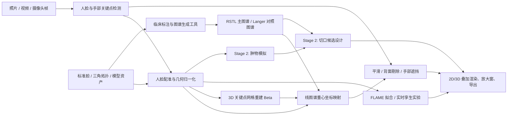

# 面部朗格线迁移 · Facial Langer/RSTL Line Projection

[](https://github.com/jwj1342/LangerFace/actions/workflows/ci.yml)

把皮肤张力线（主流程为 **RSTL**，并保留 **Langer** 对照图谱）**稳定地、贴合地**叠加到人脸的照片、视频或实时摄像头画面上，
作为面部手术**切口规划的决策辅助可视化**——医生能直观看到沿哪个方向下刀疤痕最小、恢复最好。

> ⚠️ **医学声明**：本工具是决策辅助可视化，**不是**手术指令，**不是**受监管的医疗器械。
> 内置线条图谱为**示意性首版（未经临床验证）**，方向参考 Borges RSTL，几何为近似，
> 必须经临床医生用标注工具校验后方可参考。最终切口由主刀医生负责。详见[已知局限与医学声明](#已知局限与医学声明)。

---

## 目录
- [项目定位](#项目定位)
- [系统模块与数据流](#系统模块与数据流)
- [临床目标与 Stage 2 路线](#临床目标与-stage-2-路线)
- [它能做什么](#它能做什么)
- [核心原理（为什么稳，而非"图一乐"）](#核心原理)
- [两条技术路线](#两条技术路线)
- [快速开始 / 复现](#快速开始--复现)
- [使用方式](#使用方式)
- [线条图谱（数据）](#线条图谱数据)
- [目录结构](#目录结构)
- [验证与测试](#验证与测试)
- [已知局限与医学声明](#已知局限与医学声明)
- [持续集成与部署（CI/CD）](#持续集成与部署cicd)
- [开发文档](#开发文档)
- [文档维护约定](#文档维护约定)

---

## 项目定位

LangerFace 是一个面向面部手术规划研究的计算机视觉原型。它把医学上可校验、可编辑的 RSTL 图谱编码到 MediaPipe 标准脸网格上，再在照片、视频或实时摄像头画面中将图谱稳定映射到当前人脸。经典 Langer 图谱仍作为对照 / 教学资产保留，但当前网页主 demo 只暴露 RSTL。

项目分成三层：

1. **领域数据层**：`assets/` 与 `web/assets/` 保存标准脸、关键点模型、三角拓扑和线条图谱。
2. **核心算法层**：`src/langerface/` 与 `web/src/services/geometry*.ts` 实现关键点输入、重心坐标映射、平滑、遮挡、渲染与 3D 配准。
3. **用户界面层**：`web/` 提供唯一正式前端；`src/langerface/apps/` 只保留 CLI 和 OpenCV webcam 入口。

当前主线是 **Stage 1：稳定显示面部 RSTL 皮肤张力线**。Stage 2 已进入受限工程闭环：围绕医生手动输入的面部皮肤肿物，按结构化临床规则生成可解释、可编辑、可审阅的候选切口线，并可把候选暂存到照片 / 视频 / 摄像头实时叠加层。完整 Stage 2 仍需真实肿物边界标注、正式电子签名 / 病例系统绑定、3D/AR 个体化叠加与临床验证。项目不训练自定义医学模型，不上传用户图像，也不声称自动给出手术方案。

---

## 系统模块与数据流

系统按“资产与医学知识 -> 感知 -> 配准 -> 标注/模拟/规划 -> 渲染与交互”分层。当前代码重点完成 Stage 1 的张力线标注与配准；Stage 2 的脸部肿物模拟和切口设计作为同级业务模块扩展，而不是塞进 `lines/` 或 `rendering/`。

| 层级 / 模块 | 当前状态 | 职责 | 主要位置 |
|---|---|---|---|
| 资产与医学知识层 | 已实现 | 标准脸、三角拓扑、MediaPipe 模型、RSTL 主图谱与 Langer 对照图谱 | `assets/`, `web/assets/` |
| 感知层 | 已实现 | 从图片、视频、摄像头中提取 478 个 3D 人脸关键点；网页端还检测手部遮挡 | `src/langerface/detection/`, `web/src/services/pipeline.ts` |
| 配准与几何层 | 已实现 | 2D 重心坐标贴合；3D Beta Umeyama 关键点网格重建与刚性配准；FLAME 关键点拟合实验；离线 HeadSpace 多视角加权 Sim3 配准 | `src/langerface/geometry/`, `src/langerface/registration/`, `src/langerface/flame.py`, `web/src/services/geometry*.ts`, `web/src/services/projection3d.ts`, `tools/reconstruct_3d.py`, `tools/headspace/` |
| 面部标注 / 图谱层 | 已实现 | 生成、读取、校验和映射 RSTL/Langer 线条；网页 3D 标注只产出待复核草案，临床校验由 Python/评审流程完成 | `src/langerface/lines/`, `web/src/services/annotationModel.ts`, `web/src/services/annotateViewer.ts`, `web/src/services/annotateRuntime.ts`, `tools/annotate_atlas.py`, `tools/digitize_from_diagram.py` |
| 肿物模拟层 | Stage 2 功能切片（#14） | 表示脸部肿物的位置、大小、深度、安全切缘和与皮肤表面的关系；当前支持手动中心点、椭圆 / 自由轮廓、来源作者和 JSON 导入导出，自动分割与临床复核仍待补 | `web/src/services/incisionCandidateTools.ts`, `web/src/services/tumorInput.ts`, `web/src/services/incisionAgentRuntime.ts` |
| 切口设计层 | Stage 2 工程闭环（#11-#22/#64/#83/#85） | 综合张力线方向、肿物约束、安全切缘、敏感结构、医生编辑、审阅导出和 2D 实时叠加，生成候选切口可视化；只做决策辅助，不输出手术指令 | `assets/clinical_rules_face_incision.json`, `assets/agentic_incision_tool_schema.json`, `web/src/services/incision*.ts` |
| 渲染与交互层 | 已实现 / 扩展中 | 2D Canvas 叠加、3D 查看、遮挡、放大窗、录制导出和 UI 控制 | `src/langerface/rendering/`, `web/src/services/liveRuntime.ts`, `web/src/services/render2d.ts`, `web/src/services/three3d.ts` |
| 实验演示层 | 已实现（研究演示） | FLAME 实时孪生；RSTL 切除 -> 闭合定性软体演示 | `web/src/services/flameFit.ts`, `web/src/services/mode3d.ts`, `web/src/routes/SurgeryRoute.tsx`, `web/src/services/softBody.ts` |

整体数据流：



Stage 2 的设计原则是：肿物模拟只负责病灶几何与约束表达，切口设计只负责候选方案生成与可视化，最终判断仍由临床医生完成。

---

## 临床目标与 Stage 2 路线

面部皮肤肿物切除的核心问题不是“能否画出一条线”，而是**能否在保留功能和形态的前提下，把瘢痕藏到张力最低、视觉干扰最小的位置**。本项目的 Stage 2 目标是把计算机视觉和 AI 技术用在这个术前规划场景中：

1. **迁移面部皮纹线**：把经临床校验的标准 RSTL 图谱迁移到患者照片、视频或实时扫描的脸上，作为切口方向的第一依据。
2. **表示肿物约束**：由医生输入或标注皮下 / 皮表肿物的位置、直径、边界、深度、安全切缘和可直接拉拢缝合前提。
3. **生成候选切口**：系统按规则生成线性或梭形切口候选，医生可以调整、覆盖、确认或否决。
4. **输出可追溯记录**：导出候选线、规则依据、风险提示、医生修改和版本 provenance。

两类应用情形：

| 情形 | 输入 | 默认候选 |
|---|---|---|
| **皮下肿物** | 肿物中心 + 术前超声直径 / 深度 / 医生判断 | 平行局部 RSTL 的线性切口，不做梭形切除 |
| **皮表肿物** | 肿物边界或类圆化直径 + 安全切缘 + 医生判断 | 梭形切口，长轴优先平行 RSTL，并约束长宽比例、尖端角和平滑对称 |

切口方向优先级：

1. **首选：RSTL**。切口长轴尽量平行松弛皮肤张力线，以降低闭合时垂直张力。
2. **次选：自然皱襞 / 皱纹**。额纹、鱼尾纹、鼻唇沟、睑缘纹、颏纹等自然凹陷可帮助隐藏瘢痕。
3. **次选：美学亚单位边界**。眉缘、唇红缘、发际线、鼻翼沟、耳前皱襞等结构分界处可降低视觉干扰。
4. **敏感结构例外**。下睑、唇红缘、鼻翼等游离边缘附近，系统必须提示形态牵拉风险；医生可选择违背 RSTL 的保护性方向。

安全边界：

- 默认只覆盖**可直接拉拢缝合、无需皮瓣 / 植皮**的适应证范围；适应证、松弛度、创缘成活性和安全切缘由医生团队写作和确认。
- 良性、癌前病变、恶性肿瘤的切缘策略不同，系统只记录医生输入的切缘规则，不自动判断病理性质。
- AI/CV 输出只作为候选和提示；术前仍需医生结合触诊、皮肤松弛度、器官功能风险和病理要求确认。

Stage 2 的结构化临床规则库位于 [`assets/clinical_rules_face_incision.json`](assets/clinical_rules_face_incision.json)。该资产记录区域规则、优先级、例外、来源、审核状态和最后审核日期；当前仍为 `draft_not_clinically_validated`，只用于决策辅助可视化，不是自动手术指令。Stage 2 任务拆解已同步到 [docs/TODO.md](docs/TODO.md) 与 GitHub Issues。

---

## 它能做什么

- 🎥 **网页实时摄像头**：浏览器打开网址 → 开摄像头 → 张力线实时贴合人脸，做任何动作线条都跟随。
- 🖼️ **上传照片/视频**：网页上传，叠加后返回（图片单帧、视频逐帧）。
- 🧰 **命令行批处理**：对图片/视频文件离线渲染输出。
- 🔬 **RSTL 主流程 + Langer 对照资产**：网页主 demo 当前只暴露 RSTL；Langer 图谱仍保留在资产、CLI 和标注器中用于对照 / 教学。
- 🖐️ **遮挡处理**：转头时背面线条隐藏；**手挡在脸前时，手覆盖处不画线**（贴合手形掩膜，指缝保留）。
- 🔍 **关键区域放大窗**：主画面下方 6 个放大窗（额·眉间 / 双眼周 / 鼻·鼻唇沟 / 口周 / 颏部）同屏显示细节。
- 🧊 **3D 重建（Beta）**：转头扫描 → 多帧 468 点关键点网格对齐 / 取中位数 → 旋转查看 / 实时刚性投影；这是关键点网格演示，不是临床级稠密 3D 扫描。
- 🧬 **FLAME 实时孪生（实验）**：浏览器加载紧凑 FLAME basis，本地拟合身份 / 表情 / 张嘴，右侧 FLAME 头随左侧真实人脸头姿和表情运动，可切标准 / 个体与贴脸纹理。
- ✍️ **网页 3D 标注**：在浏览器里于标准脸 / 3D 头模表面手绘 RSTL/Langer 候选线，可导入 JSON/OBJ/PLY 头模和 3D Slicer `.mrk.json` 曲线，导出 `validated:false` 的图谱草案（`[tri,u,v]`）或 xyz 折线；临床复核与置 `validated:true` 仍走 Python/评审流程，见 [网页 3D 标注与图谱草案导出](docs/ARCHITECTURE.md#12-网页-3d-线标注与图谱草案导出)。
- 🏥 **病例向导式切口工作台**：`/app/cases` 是医生主入口，按“面部评估 -> 病灶定位与切口规划 -> 方案确认”组织病例草稿、年龄分档、采集方式、病灶层次、切缘策略、规划依据、闭合模拟和导出边界。
- 🧭 **切口 Agent 工作台**：在标准脸上手动放置皮下 / 皮表肿物，支持椭圆 / 自由轮廓和肿物 JSON 导入导出，生成线性或梭形候选切口，显示 RSTL 方向、面部分区、guardrails、浏览器 workflow 工具 trace 和 provider 连通性状态；候选可记录审阅人、确认 / 退回 / 否决状态和备注，候选库会给出工程排序对比，导出审阅记录，也可发送到实时页叠加到上传照片、视频或摄像头画面。
- 🔬 **RSTL 切除 -> 闭合演示（Beta）**：医生主路径已在病例规划页内嵌张力闭合模拟；`/app/surgery` 仅作为兼容研究演示保留，用于解释沿 RSTL 闭合的张力直觉，不是 FEM、不是患者个体化建模，也不是自动候选生成模块。
- 🎛️ **实时控制**：主界面暴露数据源、线密度、透明度、镜像和网格采样点；平滑、背面剔除、手部遮挡、分区着色和放大窗为底层支持或默认能力，部分调试开关当前隐藏。
- 🔒 **全程本地运行**，不上传任何画面（隐私友好）。

---

## 核心原理

这是一个 **模板配准（template registration）** 问题，**不是**"训练模型预测线条"——也不存在这样的训练数据。

1. **预训练 AI 负责感知**：用 Google MediaPipe Face Landmarker 输出 **478 个 3D 人脸关键点**（前 468 个与标准网格拓扑一致），实时、跨姿态、跨身份。
2. **医学知识编码为"贴在标准脸上的图谱"**：张力线一次性数字化到 MediaPipe **标准脸网格**，每个线点存成 `(三角面 id, 重心坐标 u, v)`。
3. **线条随脸网格变形**：运行时同一套三角拓扑把图谱映射到检测到的人脸上——
   `点 = u·V0 + v·V1 + w·V2`（V 为该三角面三个检测顶点）。这是精确的**分片仿射变形**（即 AR"脸绘"技术），
   对身份、姿态、表情天然不变，是稳定性的根基。
4. **稳定性工程**：One-Euro 时间平滑去抖动、置信度门控淡入淡出、背面剔除、手部遮挡掩膜。

> 不训练自定义模型是刻意为之：复用稳健的预训练关键点模型 + 可编辑可校验的图谱资产，
> 才有可复现、可解释、可被临床医生修正的系统，而不是一个抖动不可控的黑盒。

单帧数据流（2D 路线）：

```
图像/帧 → MediaPipe 478 关键点 → One-Euro 平滑 → 重心坐标映射(图谱) → 背面剔除 + 手部遮挡 → 抗锯齿叠加
```

---

## 两条技术路线

网页左上「技术路线」可切换；**默认 2D（稳定）**，3D 为 Beta。

| | **2D 贴合（默认）** | **3D 关键点网格重建（Beta）** |
|---|---|---|
| 思路 | 每帧把图谱按重心坐标贴到当前帧脸网格（2.5D：用 3D 关键点，z 仅用于背面剔除）| 多帧转头扫描得到**468 点个体关键点网格**，线贴到该网格表面，实时把网格刚性配准到活体脸再投影 |
| 个性化 | 隐式（逐帧跟随真实关键点）| 显式（重建出中性关键点网格，可旋转查看；深度依赖足够偏航覆盖）|
| 表情 | 线随表情自然形变 | 刚性配准，线不随表情抖动（更像稳定的"皮肤张力图"）|
| 遮挡 | 背面剔除（启发式）| 渲染时 z 缓冲精确自遮挡 |
| 成熟度 | 稳定、已大量验证 | Beta：示例重建+旋转查看已验证；在线扫描有偏航覆盖门控，投影仍需摄像头实测 |
| 实现 | Canvas 2D | Three.js（WebGL）|

3D 重建流程：每帧 478 关键点 → 用相似变换(Umeyama)对齐到统一参考系 → **各顶点取中位数**得到稳定中性脸 →
图谱按重心坐标贴到该网格 → Three.js 渲染（可旋转）/ 每帧 Umeyama 刚性配准到活体脸投影（z 缓冲遮挡）。

除上表两条入口外，当前前端还包含两个研究演示：FLAME 实时孪生（`web/src/services/flameFit.ts` / `web/src/services/mode3d.ts`）和 RSTL 切除闭合定性演示（`/app/surgery`）。它们用于展示 3D 拟合和张力直觉，不改变 Stage 2 仍处于规划中的边界。

---

## 快速开始 / 复现

环境：**Python 3.10–3.12**（勿用 3.13，mediapipe 暂不支持）、**Node 24.15+ / npm 11+**（Vite 前端）、现代浏览器（建议 Chrome）。
在 Compute Canada / Alliance 集群上，前端开发可先运行 `module load nodejs/24.15.0`。

```bash
# 1) 依赖
pip install -e ".[all]"

# 2) 下载 MediaPipe 资产到 assets/（标准脸 obj + 人脸/手部关键点模型，单一权威源）
python3 tools/download_assets.py

# 3) 生成线条图谱（稠密方向场流线，RSTL + Langer）
python3 tools/build_field_atlas.py 0.014        # 数字越小越密

# 4) 导出网页端资产（triangles / atlas / canonical_vertices / 复制人脸+手部模型）
#    MediaPipe/atlas/topology 资产由此从 assets/ 派生；改了图谱/几何务必重跑此步（CI 有一致性门禁）
python3 tools/export_web_assets.py

# 5)（可选）用示例视频重建一个 3D 头，供 3D Beta 直接体验
python3 tools/reconstruct_3d.py local_media/IMG_3458.MOV    # -> web/assets/recon_demo.json

# 6) 测试 / 构建
pytest -q                         # Python 端
cd web
npm ci
npm run build                      # Vite 生产构建
npm test                           # Web TypeScript 几何/遮挡/Umeyama 对拍
cd ..

# 7) 启动网页
cd web
npm run dev                      # Vite dev server，默认 http://127.0.0.1:5173
```

浏览器打开 Vite 提示的本地地址 → 点「摄像头」→ 允许权限。首次加载会从 CDN 下载 MediaPipe wasm（数秒）。

---

## 使用方式

### 网页（推荐，实时）
进入 `web/` 后运行 `npm run dev`，打开 Vite 提示的本地地址：
- **数据源**：上传照片/视频，或开摄像头；可暂停、导出（录制画布为 webm）。
- **模板**：主 demo 只暴露 RSTL（首选）；Langer 对照图谱保留在资产、CLI 和标注器中。
- **滑杆**：线密度、透明度；平滑参数仍在运行时存在，但主界面调试控件当前隐藏。
- **开关**：镜像、显示网格采样点；背面剔除、手部遮挡、分区着色和细节放大窗为底层支持或默认能力，部分控件当前隐藏。
- **技术路线**：2D（默认）/ 3D 重建（Beta，含"用示例重建/转头扫描/旋转查看/投影到画面"）/ FLAME 实时孪生实验。
- **病例工作台**：进入 `/app/cases` 新建或恢复病例；医生主流程在病例内完成评估、病灶参数、切口规划、闭合模拟和方案确认。
- **实验页**：侧栏可打开 `/app/annotate` 标注器；`/app/surgery` 仍可查看 RSTL 切除 -> 闭合定性演示，但它只是兼容研究入口。旧 HTML 入口仅保留为 React SPA 兼容跳转页。
- **统计**：追踪质量、状态、脸部占比、偏航估计、线束数量、fps。

### 命令行
```bash
langerface --image face.jpg --system rstl -o out.png
langerface --video clip.mp4 --system langer -o out.mp4
langerface-webcam --system rstl          # 原生窗口实时（热键 t/o/s/q）
```

### 临床校验图谱（关键）
内置图谱仅为示意，临床医生用标注工具修正后才可作正式参考：
```bash
python3 tools/annotate_atlas.py --system rstl                       # 在标准脸上直接画/改
python3 tools/digitize_from_diagram.py --system rstl --diagram ref.png  # 从文献图描线
```

---

## 线条图谱（数据）

线图谱是 JSON：信封带 `topologyId` / `topologyVersion`，每条线为 `[三角面id, u, v]` 重心坐标点序列（`w = 1−u−v`），网页注入时校验拓扑身份。由 [`tools/build_field_atlas.py`](tools/build_field_atlas.py) 用张力线**方向场 + 等间距流线**生成，当前 RSTL **132 条**、Langer **110 条**；方向遵循 **Borges RSTL** 走向、几何为近似、`validated: false`，临床医生经 `annotate_atlas.py` / `digitize_from_diagram.py` 修正后置 `validated: true`。

> 数据格式、方向场算法与生成流程的完整说明见 [ARCHITECTURE.md «6. 图谱（数据）生成与格式»](docs/ARCHITECTURE.md)。

---

## 目录结构

| 路径 | 作用 |
|---|---|
| `.claude/` | Claude Code 相关启动配置；本地私有设置文件已被 `.gitignore` 排除。 |
| `.github/` | GitHub Actions CI；包含 Python 测试、Vite 构建和 Web TypeScript 几何对拍。 |
| `assets/` | Python 端权威资产：MediaPipe 标准脸 obj、人脸 landmarker `.task`、RSTL/Langer atlas JSON；`assets/flame/` 仅放本地 license-gated 原始 FLAME 资产。 |
| `docs/` | **全部项目文档集中于此**，命名统一 `UPPER_SNAKE_CASE.md`、单一职责；完整清单见下方[开发文档索引](#开发文档)。 |
| `src/langerface/` | Python 核心库，按 `config/geometry/detection/lines/rendering/pipeline/media/apps` 分层。 |
| `tests/` | pytest 测试，覆盖图谱、标准脸、映射、稳定性、渲染和 pipeline 行为。 |
| `tools/` | 资产下载、图谱生成、web 资产导出、3D 重建、临床标注、目检和对拍脚本。 |
| `web/` | Vite 8 + React + TypeScript 前端；Canvas 2D + MediaPipe Tasks + Three.js / R3F 3D Beta。 |
| `web/src/services/geometry*.ts` | Web TypeScript 几何子系统：atlas 映射 / 平滑 / 遮挡 / Umeyama。 |
| `web/assets/` | 浏览器端静态资产：MediaPipe/atlas/topology 由 `tools/export_web_assets.py` 从 `assets/` 派生（勿手改，CI 有一致性门禁，见 #47）；紧凑 FLAME basis 由 `tools/build_flame_basis.py` 生成并带署名 notice。 |
| `web/test/` | Web/Python 几何对拍用 ground truth 和本地测试图像；真实图片被忽略。 |
| `local_media/` | 本地视频、照片和输出视频，例如 `IMG_3458.MOV`、`out_rstl.mp4`；不提交。 |
| `logs/` | 本地运行日志；不提交。 |
| `local_outputs/` | 本地调试输出，例如 `local_outputs/debug_frames/` 里的目检截图和拼图；不提交。 |
| `local_archives/` | 本地压缩包、外部资料归档；不提交。 |

关键文件：

| 文件 | 作用 |
|---|---|
| `pyproject.toml` | Python 包元数据、可选依赖、console scripts、ruff/pytest 配置。 |
| `requirements.txt` | 兼容旧流程的 Python 依赖入口；推荐使用 `pip install -e ".[all]"`。 |
| `web/package.json` | Node 24 / Vite 8 前端脚本和 npm 依赖。 |
| `web/vite.config.ts` | Vite 静态资产处理、生产构建和本地 dev server 配置。 |

---

## 验证与测试

两套几何实现（Python / JS）由**逐点对拍**保证一致：`cd web && npm test`（架构无环 + 映射误差 ~5×10⁻⁵px + 背面剔除 0 不一致 + One-Euro / 拓扑契约 / FLAME / soft-body / 诊断导出）与 `pytest`（图谱完整性、仿射不变性、渲染、资产同步、可观测性）全绿即可。

> 各测试的职责、目检脚本与浏览器实测清单见 [CONTRIBUTING.md «运行测试»](docs/CONTRIBUTING.md#运行测试)；跨语言对拍不变式与金标重生成见 [CROSS_LANG_PARITY.md](docs/CROSS_LANG_PARITY.md)。

---

## 已知局限与医学声明

### 医学声明（务必先读）

本系统是**面部手术切口规划的决策辅助可视化工具**：把皮肤张力线叠加到病人脸部影像上，帮助术者直观判断切口走向。

- 它**不是**手术指令，**不是**自主决策系统，**不是**受监管的医疗器械（未经任何药监 / FDA / CE 认证）。
- 最终切口位置与方向由**主刀医生**根据病人个体情况判断并负责。
- 叠加线条为几何近似，受关键点检测误差、姿态、表情、光照影响，**仅供参考**。

### 两套线系统的临床取舍

当前网页主 demo 只暴露 RSTL，避免把 Langer 对照误认为面部切口首选；Langer 仍保留在资产、CLI 和标注器中用于对照 / 教学。

| 系统 | 含义 | 面部适用性 |
|---|---|---|
| **RSTL（默认）** | Borges 松弛皮肤张力线（活体、放松状态）| 面部切口的**临床首选**参考 |
| **Langer** | 经典 Langer 裂线（1861，尸体）| 面部多处与最佳切口方向**不一致甚至垂直**，仅作对照 / 教学 |

依据 Borges & Alexander (1962/1984)：活体 RSTL 比尸体 Langer 线更适合指导面部切口；两者在鼻背、眦外、颏部、颞部等区域走向分歧明显。

### 图谱校验状态

⚠️ 内置图谱为**示意性首版（`validated: false`）**：由 `tools/build_field_atlas.py` 按 Borges RSTL 总体走向程序化生成，几何为近似，**尚未经临床验证，不得直接用于真实临床决策**。校验流程见上文[临床校验图谱](#临床校验图谱关键)，完成后图谱 `validated` 置 `true` 并在 `provenance` 记录校验者。

### 切口设计临床边界

Stage 2 的切口候选必须受以下边界约束：

- 皮下肿物与皮表肿物分开建模；皮下肿物默认生成线性切口，皮表肿物才生成梭形切口。
- 3:1 长轴 / 类圆化肿物直径、尖端角 30°、两侧弧线对称平滑等规则按医生团队指定实现为**可配置规则**，同时保留医生覆盖。
- 下睑、唇红缘、鼻翼等敏感游离边缘附近，系统必须优先提示功能与形态风险；必要时可由医生选择违背 RSTL 的保护性方向。
- 安全切缘、松弛度、可无张力自然对合、是否需要皮瓣 / 植皮等不由算法自动判断，必须由医生团队在术前评估中确认。

### 技术稳定性边界（已知较弱区域）

- **图谱医学准确性**是首要限制：CV 管线可做到很稳，但源图谱须临床专家验证。
- **前额**：MediaPipe 关键点稀疏，该区线条精度较低。
- **极端侧脸 / 大角度旋转**：背面剔除会隐藏背侧线条；接近纯侧脸时正面线条也可能漂移。
- **外部遮挡**：已支持**手部**（贴合手形掩膜，指缝保留）；**器械、纱布、口罩**等暂不识别。
- **强光 / 阴影 / 低分辨率**：降低关键点置信度，触发淡出。
- **多张脸**：网页端 Face Landmarker 当前配置为单脸追踪；多人同框时只处理首个检测结果，快速进出画面时可能错配。
- **3D Beta**：当前在线重建是 468 点关键点网格，不是稠密患者头模；刚性配准不随表情形变；在线扫描 / 实时投影需摄像头实测；尚未做非刚性配准与网格导出。
- **FLAME 实验**：已支持浏览器内实时孪生和本地/兜底拟合 basis，但医生 FLAME 标准线渲染到个体 FLAME 头、Mode-B 3D 扫描配准等仍在 #61 后续工作中。
- **切除闭合演示**：病例规划页内嵌的张力闭合模拟是医生主流程反馈；`/app/surgery` 仍是标准脸上的定性表面软体研究演示，只解释沿 RSTL 闭合的张力直觉，不能替代真实软组织 FEM、患者个体化建模或正式候选审阅。

### 数据与隐私

病人面部影像属敏感个人信息。本工具默认**本地运行，不上传任何数据**。Vite 前端默认用于本地研究演示；如需对外暴露，请自行加访问控制与合规审查（HIPAA / GDPR / 《个人信息保护法》）。

Stage 2 切口 Agent 默认只把肿物参数、标准化坐标、候选切口、工具调用 trace 和审阅记录作为结构化 JSON 处理；导出 JSON / 报告草案不默认包含原始照片、视频帧、摄像头画面或纹理。自然皱襞 / 病灶辅助线索当前只允许以低置信摘要和 metrics 进入医生审阅，不自动改变切口几何，也不进入 LLM prompt。前端只保留 OpenAI-compatible / vLLM Provider 配置，可填写 Base URL、模型和访问密钥；密钥仅用于当前浏览器到用户提供 Provider 的连通性测试或后续摘要调用，审阅记录会做脱敏，不写入公开仓库。详细边界见 [`docs/INCISION_PRIVACY_AUDIT.md`](docs/INCISION_PRIVACY_AUDIT.md)。

---

## 持续集成与部署（CI/CD）

- **CI**：push 到 `master` / `refactor/**` 或发 PR 时，[`.github/workflows/ci.yml`](.github/workflows/ci.yml) 跑三个并行 job —— `lint`（`ruff check .`）、`python-tests`（`pytest`，**Python 3.10 / 3.11 / 3.12** 矩阵，不装 mediapipe）、`js-tests`（**Node 24**：`npm ci` + `npm run build` + `npm test` 对拍 Web TypeScript 几何与 Python 一致）。提交前可装 `pre-commit`（[`.pre-commit-config.yaml`](.pre-commit-config.yaml)）做本地预检。
- **CD**：网页是 Vite 构建的**纯静态站点**（`web/dist/`，全程浏览器运行、无后端），经 Vercel Git 集成自动部署（自动 HTTPS → 线上摄像头可用），Vercel Project 的 Root Directory 设为 `web`。
- **隐私**：`web/assets/recon_demo.json` 是示例视频重建出的 468 点关键点网格，随站点**公开**；不想公开就把它加入 [`web/.vercelignore`](web/.vercelignore)（"用示例重建"按钮失效，仍可"转头扫描"）。

> Vercel Project 设置、Production URL、branch protection 必需检查、Preview 访问策略、手动部署 fallback 与排障清单，全部见 **[CI/CD 与 Vercel 部署指南](docs/CI_CD_VERCEL.md)**。

## 开发文档

所有项目文档集中在 `docs/`，文件名统一为 `UPPER_SNAKE_CASE.md`，**每个文档单一职责**。下表为索引（按「上手 → 架构 → 质量 → 临床 → 规划」分组）——想用 AI 编码工具熟悉本项目，从这里按需进入：

| 文档 | 职责 |
|---|---|
| **上手 / 协作** | |
| [ENVIRONMENT.md](docs/ENVIRONMENT.md) | 本地 / 集群环境、venv、Node 24、测试与本地产物目录 |
| [CONTRIBUTING.md](docs/CONTRIBUTING.md) | 协作流程、测试约定、扩展点、PR 要求 |
| [ENGINEERING_LESSONS.md](docs/ENGINEERING_LESSONS.md) | 多人并行协作踩过的坑、避坑规则与提交前清单 |
| **架构 / 数据** | |
| [ARCHITECTURE.md](docs/ARCHITECTURE.md) | 核心算法、坐标系、2D/3D 路线、网页 3D 标注、HeadSpace 离线管线、Stage 2 路线、资产与部署 |
| [METHODS_AND_IMPLEMENTATION_SUMMARY.md](docs/METHODS_AND_IMPLEMENTATION_SUMMARY.md) | 各核心算法的**数学公式与推导**集中参考（重心映射 / One-Euro / 遮挡 / 流线生成 / Umeyama / FLAME / 软体 / 切口几何）；模块契约见 ARCHITECTURE，测试见 CONTRIBUTING |
| [BACKEND_DATA_ARCHITECTURE.md](docs/BACKEND_DATA_ARCHITECTURE.md) | 后端数据层、Cloudflare Worker/D1/R2、重计算边界与阶段落地 |
| [FLAME_3D_TRACK.md](docs/FLAME_3D_TRACK.md) | 3D FLAME 配准 / 标注轨的设计与技术选型（issue #61）|
| [INCISION_FLAME_ASSET_STRATEGY.md](docs/INCISION_FLAME_ASSET_STRATEGY.md) | 切口工作台使用 FLAME 头模资产的核验点、设计边界、回退策略和验收重点 |
| [RSTL_3DMM_PRIOR.md](docs/RSTL_3DMM_PRIOR.md) | Borges RSTL 来源、3DMM 拓扑先验 manifest、与 #2/#13/#61 的衔接 |
| [rstl_3dmm_prior_manifest.json](assets/rstl_3dmm_prior_manifest.json) | MediaPipe/3DMM RSTL 先验资产 manifest；高密度方向场大 JSON 由远端资产或本地生成提供（issue #86，`validated:false`） |
| **质量 / 运维** | |
| [CROSS_LANG_PARITY.md](docs/CROSS_LANG_PARITY.md) | Python ⇄ Web TypeScript ⇄ 金标逐点对拍不变式与金标重生成 |
| [OBSERVABILITY.md](docs/OBSERVABILITY.md) | 浏览器诊断 JSON、结构化事件字段、计数器与运行时指标（issue #51）|
| [CI_CD_VERCEL.md](docs/CI_CD_VERCEL.md) | Vercel 设置、Preview 访问策略、branch protection 与排障 |
| [LABELS.md](docs/LABELS.md) | issue / PR 标签规范 |
| **临床 / 合规** | |
| [ANNOTATION_QA.md](docs/ANNOTATION_QA.md) | 3D 标注贴面平滑、绘制反馈与导出一致性验收清单（issue #84） |
| [VALIDATION.md](docs/VALIDATION.md) | 临床验证数据集、Stage 1/2 指标、失败分类、人工评审表（issue #20）|
| [PRIVACY_AND_AUDIT.md](docs/PRIVACY_AND_AUDIT.md) | 敏感数据边界、禁止提交项、导出约束、审计字段（issue #21）|
| [PRODUCT_BOUNDARIES.md](docs/PRODUCT_BOUNDARIES.md) | 近期聚焦表皮 RSTL 与病灶处理，暂缓肌肉骨骼实时孪生（issue #87） |
| [CLINICAL_CASE_WORKFLOW_UI.md](docs/CLINICAL_CASE_WORKFLOW_UI.md) | UI 产品化重构方案：从工具工作台转向病例向导式临床流程 |
| [WRINKLE_LESION_CUES.md](docs/WRINKLE_LESION_CUES.md) | 自然皱襞、皱纹与皮表肿物边界辅助线索调研和合成原型（issue #22）|
| **规划** | |
| [TODO.md](docs/TODO.md) | 路线图与待办（与 GitHub Issues 同步）|

> 医学声明、图谱状态与临床局限见 README [已知局限与医学声明](#已知局限与医学声明)。

## 文档维护约定

**本仓库的 [README.md](README.md)、[docs/ARCHITECTURE.md](docs/ARCHITECTURE.md)、[docs/ENVIRONMENT.md](docs/ENVIRONMENT.md) 必须与代码保持同步。**
任何功能更新（新增/修改特性、改动数据流、增删模块或资产、调整使用方式）都要在同一改动中更新这些文档，
确保"读文档即可了解全貌并复现项目"。医学相关变化同时更新本 README 的[已知局限与医学声明](#已知局限与医学声明)小节；路线图变化更新 [docs/TODO.md](docs/TODO.md)。

**文档规范**（便于人与 AI 编码工具都能快速定位）：
- 文件名统一 `UPPER_SNAKE_CASE.md`，放在 `docs/`；一个文档只承担一个职责，别把不相关主题塞进同一篇。
- 新增文档时，**同步把它加进上方[「开发文档」索引](#开发文档)表**并写清职责；删除/重命名文档时同步改索引与所有引用它的链接。
- 文档顶部用一句话点明本篇职责（"本文…"），与索引里的职责描述一致。
